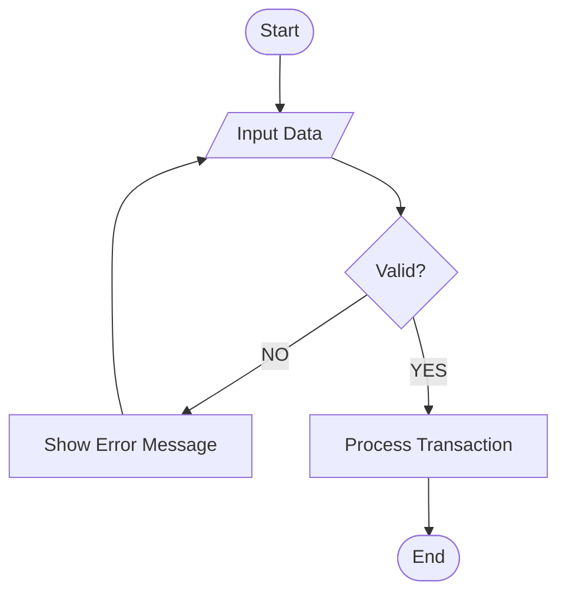

# Likhang Kamay — Flowchart Documentation Guidelines

This document establishes the **strict mandatory standards** for all system flowcharts within the Likhang Kamay project. Adherence to these rules is required for consistency across all technical documentation.

## 1. Core Structure
- **Direction**: All flowcharts must use a **Top-Down (TD)** vertical orientation.
- **Syntax**: Use Mermaid.js `flowchart TD`.
- **Primary Goal**: Clear, linear progression from "Start" to "End".

## 2. Node Shapes & Meanings
You **MUST** use the following shapes for their designated purposes:

| Element | Shape | Mermaid Syntax | Purpose |
| :--- | :--- | :--- | :--- |
| **Terminal** | Oval / Stadium | `([Text])` | Represents the **Start** or **End** of a process. |
| **Process** | Rectangle | `[Text]` | Represents a standard action, calculation, or internal process. |
| **Input/Output** | Parallelogram | `[/Text/]` | Represents user input (e.g., "Input Email") or system output. |
| **Decision** | Diamond | `{Text}` | Represents a logic junction (e.g., "Is Paid?"). |
| **Connector** | Circle | `((A))` | Links between disparate modules or different pages of a flowchart. |

## 3. Decision Logic & Labeling
Decisions are the most critical part of the system flow.
- **Mandatory Labels**: Every connector line exiting a Decision diamond **MUST** be labeled with exactly `YES` or `NO` (all caps).
- **YES Path**: Should always proceed **downward** or forward toward the objective.
- **NO Path**: Should either:
    1.  **Loop back** to a previous input step (e.g., "Re-input Credentials").
    2.  Lead to an **Error State** or an **End** node.

## 4. Visual Standards
- **Concise Text**: Keep node text to 3-5 words maximum.
- **No Path Crossings**: Organize nodes to minimize overlapping lines.
- **Color Palettes**: Avoid inline styling. Maintain the default clean aesthetic unless explicitly requested otherwise.

## 5. Implementation Example (The Standard)

## 6. Logic Completion Rule
Every branch created by a decision or sub-process must eventually terminate in an `End` node or reconnect to the main flow. **Isolated nodes are prohibited.**
