# Likhang Kamay — Complete System Flowcharts

> **Style**: Sergio Law Legal Case Management System  
> **Structure**: Top-Down vertical flow  
> **Legend**: Ovals = Start/End · Diamonds = Decisions (YES/NO) · Rectangles = Processes · Parallelograms = Input/Output

---

## I. ENTRY — Landing Page

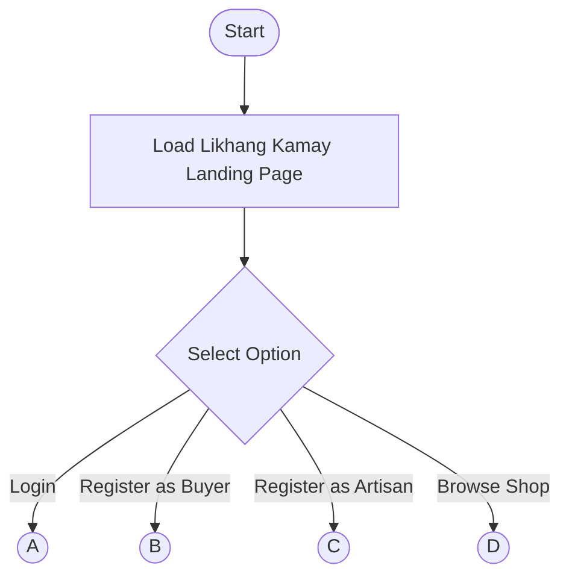
```mermaid
flowchart TD
    Start([Start]) --> Land[Load Likhang Kamay Landing Page]
    Land --> Choice{Select Option}
    Choice -->|Login| A((A))
    Choice -->|Register as Buyer| B((B))
    Choice -->|Register as Artisan| C((C))
    Choice -->|Browse Shop| D((D))
```

---

## II. LOGIN PROCESS (Start A)

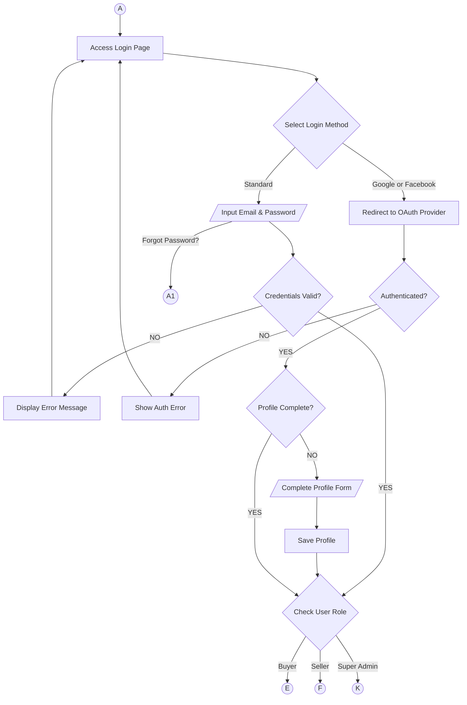
```mermaid
flowchart TD
    A((A)) --> Page[Access Login Page]
    Page --> Method{Select Login Method}

    Method -->|Standard| InputCred[/Input Email & Password/]
    InputCred --> ValidCred{Credentials Valid?}
    ValidCred -- NO --> ErrMsg[Display Error Message]
    ErrMsg --> Page

    ValidCred -- YES --> RoleCheck{Check User Role}
    RoleCheck -->|Buyer| BuyerHome((E))
    RoleCheck -->|Seller| SellerDash((F))
    RoleCheck -->|Super Admin| AdminDash((K))

    Method -->|Google or Facebook| SocialAuth[Redirect to OAuth Provider]
    SocialAuth --> AuthOk{Authenticated?}
    AuthOk -- NO --> ErrSocial[Show Auth Error]
    ErrSocial --> Page

    AuthOk -- YES --> ProfileComplete{Profile Complete?}
    ProfileComplete -- NO --> CompleteForm[/Complete Profile Form/]
    CompleteForm --> SaveProfile[Save Profile]
    SaveProfile --> RoleCheck

    ProfileComplete -- YES --> RoleCheck

    InputCred -->|Forgot Password?| FP((A1))
```

---

## III. PASSWORD RECOVERY (Start A1)

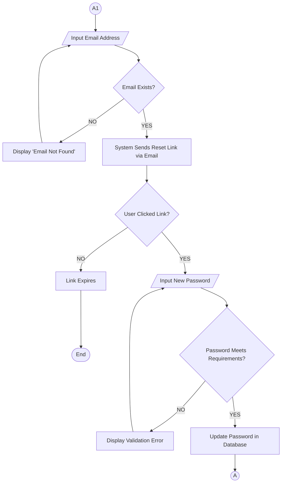
```mermaid
flowchart TD
    A1((A1)) --> InputEmail[/Input Email Address/]
    InputEmail --> EmailExist{Email Exists?}
    EmailExist -- NO --> NotFound[Display 'Email Not Found']
    NotFound --> InputEmail

    EmailExist -- YES --> SendLink[System Sends Reset Link via Email]
    SendLink --> Clicked{User Clicked Link?}
    Clicked -- NO --> Expire[Link Expires]
    Expire --> End1([End])

    Clicked -- YES --> NewPass[/Input New Password/]
    NewPass --> PassValid{Password Meets Requirements?}
    PassValid -- NO --> PassErr[Display Validation Error]
    PassErr --> NewPass

    PassValid -- YES --> UpdateDB[Update Password in Database]
    UpdateDB --> ReturnLogin((A))
```

---

## IV. BUYER REGISTRATION (Start B)

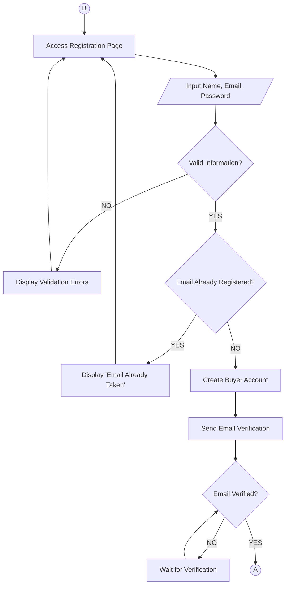
```mermaid
flowchart TD
    B((B)) --> RegPage[Access Registration Page]
    RegPage --> InputReg[/Input Name, Email, Password/]
    InputReg --> Validate{Valid Information?}
    Validate -- NO --> RegErr[Display Validation Errors]
    RegErr --> RegPage

    Validate -- YES --> EmailUnique{Email Already Registered?}
    EmailUnique -- YES --> DupErr[Display 'Email Already Taken']
    DupErr --> RegPage

    EmailUnique -- NO --> CreateAcc[Create Buyer Account]
    CreateAcc --> VerifyEmail[Send Email Verification]
    VerifyEmail --> Verified{Email Verified?}
    Verified -- NO --> WaitVerify[Wait for Verification]
    WaitVerify --> Verified

    Verified -- YES --> LoginRedirect((A))
```

---

## V. ARTISAN / SELLER REGISTRATION (Start C)

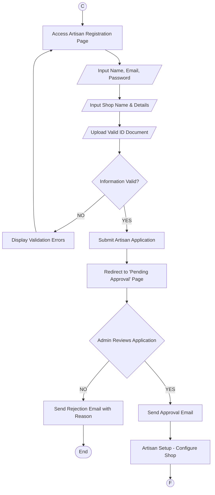
```mermaid
flowchart TD
    C((C)) --> ArtForm[Access Artisan Registration Page]
    ArtForm --> InputArt[/Input Name, Email, Password/]
    InputArt --> ShopInfo[/Input Shop Name & Details/]
    ShopInfo --> UploadID[/Upload Valid ID Document/]
    UploadID --> ArtValid{Information Valid?}
    ArtValid -- NO --> ArtErr[Display Validation Errors]
    ArtErr --> ArtForm

    ArtValid -- YES --> SubmitApp[Submit Artisan Application]
    SubmitApp --> Pending[Redirect to 'Pending Approval' Page]
    Pending --> AdminReview{Admin Reviews Application}
    AdminReview -- NO --> Rejected[Send Rejection Email with Reason]
    Rejected --> End2([End])

    AdminReview -- YES --> Approved[Send Approval Email]
    Approved --> SetupShop[Artisan Setup - Configure Shop]
    SetupShop --> SellerDash((F))
```

---

## VI. SHOP / PRODUCT BROWSING (Start D)

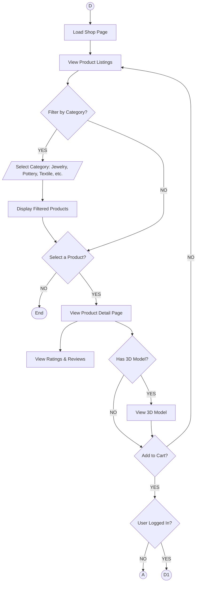
```mermaid
flowchart TD
    D((D)) --> ShopPage[Load Shop Page]
    ShopPage --> BrowseList[View Product Listings]
    BrowseList --> FilterCat{Filter by Category?}
    FilterCat -- YES --> SelectCat[/Select Category: Jewelry, Pottery, Textile, etc./]
    SelectCat --> FilteredList[Display Filtered Products]
    FilteredList --> SelectProd{Select a Product?}

    FilterCat -- NO --> SelectProd
    SelectProd -- NO --> End3([End])
    SelectProd -- YES --> ProdDetail[View Product Detail Page]

    ProdDetail --> ViewReviews[View Ratings & Reviews]
    ProdDetail --> View3D{Has 3D Model?}
    View3D -- YES --> Show3D[View 3D Model]
    View3D -- NO --> CartDecision{Add to Cart?}
    Show3D --> CartDecision

    CartDecision -- NO --> BrowseList
    CartDecision -- YES --> LoggedIn{User Logged In?}
    LoggedIn -- NO --> LoginRedirect2((A))
    LoggedIn -- YES --> AddCart((D1))
```

---

## VII. CART MANAGEMENT (Start D1)

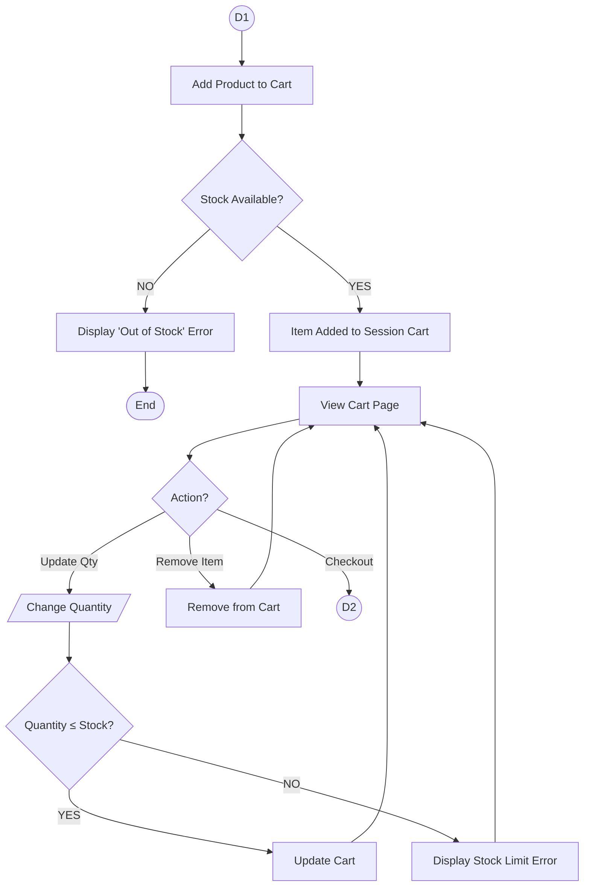
```mermaid
flowchart TD
    D1((D1)) --> AddItem[Add Product to Cart]
    AddItem --> StockOk{Stock Available?}
    StockOk -- NO --> StockErr[Display 'Out of Stock' Error]
    StockErr --> End4([End])

    StockOk -- YES --> CartAdded[Item Added to Session Cart]
    CartAdded --> ViewCart[View Cart Page]
    ViewCart --> CartAction{Action?}

    CartAction -->|Update Qty| UpdateQty[/Change Quantity/]
    UpdateQty --> QtyValid{Quantity ≤ Stock?}
    QtyValid -- YES --> SaveQty[Update Cart]
    QtyValid -- NO --> QtyErr[Display Stock Limit Error]
    QtyErr --> ViewCart
    SaveQty --> ViewCart

    CartAction -->|Remove Item| RemoveItem[Remove from Cart]
    RemoveItem --> ViewCart

    CartAction -->|Checkout| Checkout((D2))
```

---

## VIII. CHECKOUT & ORDER PLACEMENT (Start D2)

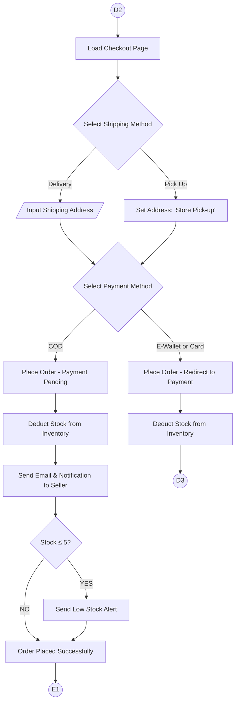
```mermaid
flowchart TD
    D2((D2)) --> CheckoutPage[Load Checkout Page]
    CheckoutPage --> ShipMethod{Select Shipping Method}
    ShipMethod -->|Delivery| InputAddr[/Input Shipping Address/]
    ShipMethod -->|Pick Up| PickUp[Set Address: 'Store Pick-up']
    InputAddr --> PayMethod{Select Payment Method}
    PickUp --> PayMethod

    PayMethod -->|COD| CODOrder[Place Order - Payment Pending]
    PayMethod -->|E-Wallet or Card| OnlineOrder[Place Order - Redirect to Payment]

    CODOrder --> StockDeduct[Deduct Stock from Inventory]
    StockDeduct --> Notif[Send Email & Notification to Seller]
    Notif --> LowStock{Stock ≤ 5?}
    LowStock -- YES --> AlertSeller[Send Low Stock Alert]
    LowStock -- NO --> OrderPlaced
    AlertSeller --> OrderPlaced[Order Placed Successfully]
    OrderPlaced --> MyOrders((E1))

    OnlineOrder --> StockDeduct2[Deduct Stock from Inventory]
    StockDeduct2 --> PayGateway((D3))
```

---

## IX. PAYMENT GATEWAY — PayMongo (Start D3)

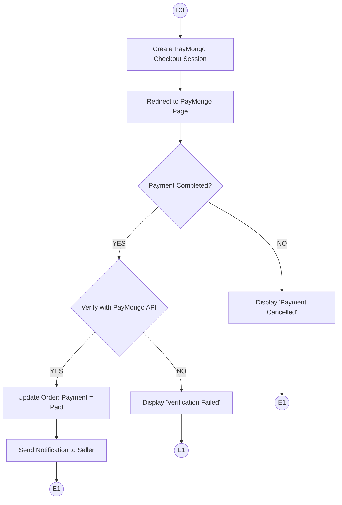
```mermaid
flowchart TD
    D3((D3)) --> InitPay[Create PayMongo Checkout Session]
    InitPay --> RedirectPay[Redirect to PayMongo Page]
    RedirectPay --> PayAction{Payment Completed?}

    PayAction -- YES --> VerifyPay{Verify with PayMongo API}
    VerifyPay -- YES --> MarkPaid[Update Order: Payment = Paid]
    MarkPaid --> NotifSeller[Send Notification to Seller]
    NotifSeller --> MyOrders2((E1))

    VerifyPay -- NO --> PayFail[Display 'Verification Failed']
    PayFail --> MyOrders3((E1))

    PayAction -- NO --> Cancelled[Display 'Payment Cancelled']
    Cancelled --> MyOrders4((E1))
```

---

## X. BUYER — MY ORDERS (Start E / E1)

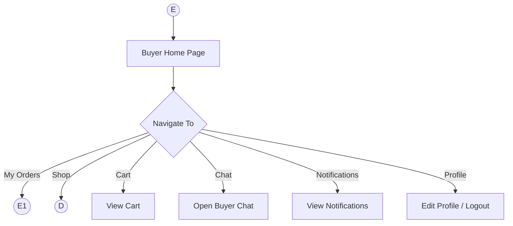
```mermaid
flowchart TD
    E((E)) --> Home[Buyer Home Page]
    Home --> NavBuyer{Navigate To}
    NavBuyer -->|My Orders| E1((E1))
    NavBuyer -->|Shop| D((D))
    NavBuyer -->|Cart| ViewCart2[View Cart]
    NavBuyer -->|Chat| Chat[Open Buyer Chat]
    NavBuyer -->|Notifications| Notifs[View Notifications]
    NavBuyer -->|Profile| Prof[Edit Profile / Logout]
```

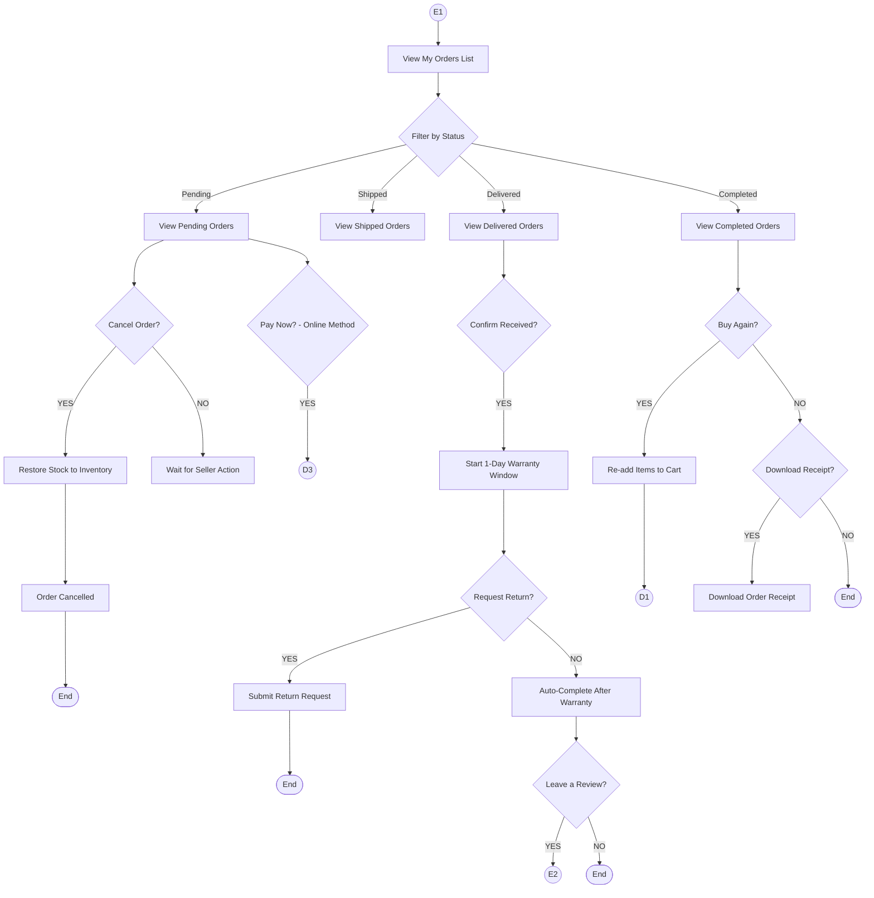
```mermaid
flowchart TD
    E1((E1)) --> OrderList[View My Orders List]
    OrderList --> StatusTab{Filter by Status}
    StatusTab -->|Pending| PendOrd[View Pending Orders]
    StatusTab -->|Shipped| ShipOrd[View Shipped Orders]
    StatusTab -->|Delivered| DelOrd[View Delivered Orders]
    StatusTab -->|Completed| CompOrd[View Completed Orders]

    PendOrd --> CancelOpt{Cancel Order?}
    CancelOpt -- YES --> RestoreStock[Restore Stock to Inventory]
    RestoreStock --> Cancelled2[Order Cancelled]
    Cancelled2 --> End5([End])
    CancelOpt -- NO --> WaitSeller[Wait for Seller Action]

    PendOrd --> PayOpt{Pay Now? - Online Method}
    PayOpt -- YES --> PayGateway2((D3))

    DelOrd --> ReceiveOpt{Confirm Received?}
    ReceiveOpt -- YES --> StartWarranty[Start 1-Day Warranty Window]
    StartWarranty --> ReturnOpt{Request Return?}
    ReturnOpt -- YES --> ReturnReq[Submit Return Request]
    ReturnReq --> End6([End])
    ReturnOpt -- NO --> AutoComplete[Auto-Complete After Warranty]
    AutoComplete --> ReviewOpt{Leave a Review?}
    ReviewOpt -- YES --> WriteReview((E2))
    ReviewOpt -- NO --> End7([End])

    CompOrd --> BuyAgain{Buy Again?}
    BuyAgain -- YES --> ReAddCart[Re-add Items to Cart]
    ReAddCart --> ViewCart3((D1))
    BuyAgain -- NO --> Receipt{Download Receipt?}
    Receipt -- YES --> DownloadPDF[Download Order Receipt]
    Receipt -- NO --> End8([End])
```

---

## XI. BUYER — SUBMIT REVIEW (Start E2)

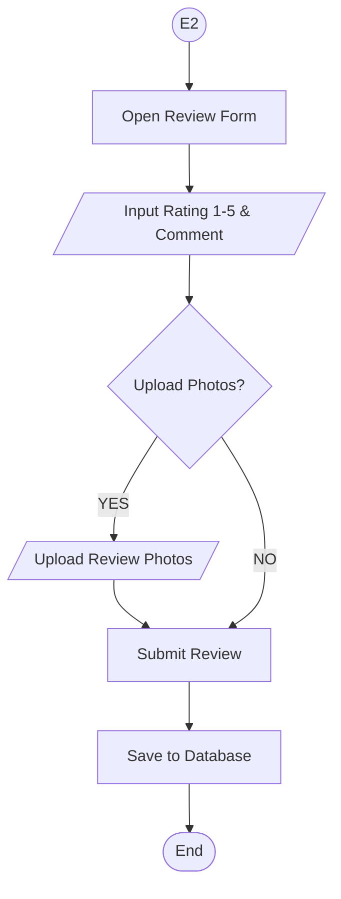
```mermaid
flowchart TD
    E2((E2)) --> ReviewForm[Open Review Form]
    ReviewForm --> InputReview[/Input Rating 1-5 & Comment/]
    InputReview --> UploadPhotos{Upload Photos?}
    UploadPhotos -- YES --> AddPhotos[/Upload Review Photos/]
    AddPhotos --> SubmitReview[Submit Review]
    UploadPhotos -- NO --> SubmitReview
    SubmitReview --> SaveReview[Save to Database]
    SaveReview --> End9([End])
```

---

## XII. SELLER DASHBOARD (Start F)

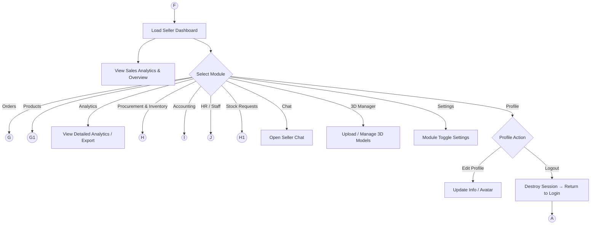
```mermaid
flowchart TD
    F((F)) --> LoadDash[Load Seller Dashboard]
    LoadDash --> ViewStats[View Sales Analytics & Overview]
    LoadDash --> SellerNav{Select Module}
    SellerNav -->|Orders| G((G))
    SellerNav -->|Products| G1((G1))
    SellerNav -->|Analytics| Analytics[View Detailed Analytics / Export]
    SellerNav -->|Procurement & Inventory| H((H))
    SellerNav -->|Accounting| I((I))
    SellerNav -->|HR / Staff| J((J))
    SellerNav -->|Stock Requests| H1((H1))
    SellerNav -->|Chat| SellerChat[Open Seller Chat]
    SellerNav -->|3D Manager| Manage3D[Upload / Manage 3D Models]
    SellerNav -->|Settings| Settings[Module Toggle Settings]
    SellerNav -->|Profile| SellerProf{Profile Action}
    SellerProf -->|Edit Profile| EditProf[Update Info / Avatar]
    SellerProf -->|Logout| Logout[Destroy Session → Return to Login]
    Logout --> LoginReturn((A))
```

---

## XIII. SELLER — ORDER MANAGEMENT (Start G)

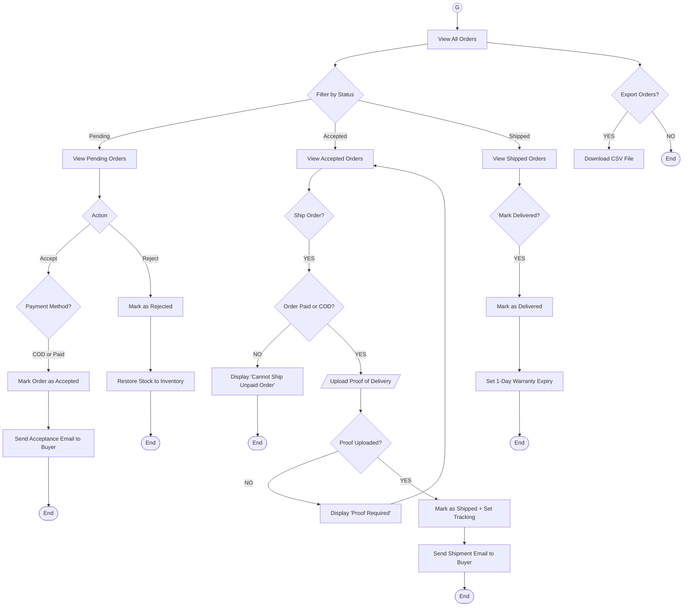
```mermaid
flowchart TD
    G((G)) --> OrderPage[View All Orders]
    OrderPage --> OrdTab{Filter by Status}
    OrdTab -->|Pending| PendSeller[View Pending Orders]
    OrdTab -->|Accepted| AccSeller[View Accepted Orders]
    OrdTab -->|Shipped| ShipSeller[View Shipped Orders]

    PendSeller --> SellerAction{Action}
    SellerAction -->|Accept| CheckPay{Payment Method?}
    CheckPay -->|COD or Paid| AcceptOrd[Mark Order as Accepted]
    AcceptOrd --> EmailBuyer[Send Acceptance Email to Buyer]
    EmailBuyer --> End10([End])

    SellerAction -->|Reject| RejectOrd[Mark as Rejected]
    RejectOrd --> RestoreStock2[Restore Stock to Inventory]
    RestoreStock2 --> End11([End])

    AccSeller --> ShipAction{Ship Order?}
    ShipAction -- YES --> PaidCheck{Order Paid or COD?}
    PaidCheck -- NO --> PayErr[Display 'Cannot Ship Unpaid Order']
    PayErr --> End12([End])
    PaidCheck -- YES --> ProofUpload[/Upload Proof of Delivery/]
    ProofUpload --> ProofOk{Proof Uploaded?}
    ProofOk -- NO --> ProofErr[Display 'Proof Required']
    ProofErr --> AccSeller
    ProofOk -- YES --> MarkShipped[Mark as Shipped + Set Tracking]
    MarkShipped --> ShipEmail[Send Shipment Email to Buyer]
    ShipEmail --> End13([End])

    ShipSeller --> DeliverAction{Mark Delivered?}
    DeliverAction -- YES --> MarkDel[Mark as Delivered]
    MarkDel --> SetWarranty[Set 1-Day Warranty Expiry]
    SetWarranty --> End14([End])

    OrderPage --> ExportCSV{Export Orders?}
    ExportCSV -- YES --> DownloadCSV[Download CSV File]
    ExportCSV -- NO --> End15([End])
```

---

## XIV. SELLER — PRODUCT MANAGEMENT (Start G1)

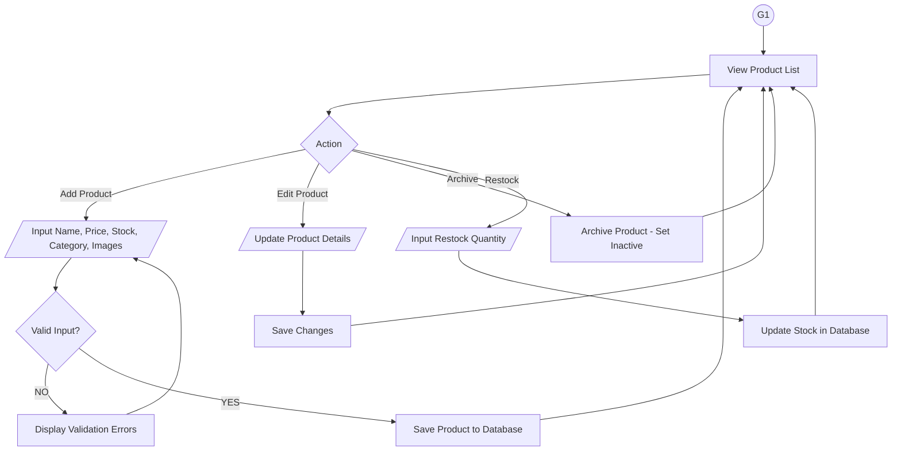
```mermaid
flowchart TD
    G1((G1)) --> ProdList[View Product List]
    ProdList --> ProdAction{Action}
    ProdAction -->|Add Product| AddForm[/Input Name, Price, Stock, Category, Images/]
    AddForm --> SaveProd{Valid Input?}
    SaveProd -- NO --> ProdErr[Display Validation Errors]
    ProdErr --> AddForm
    SaveProd -- YES --> StoreProd[Save Product to Database]
    StoreProd --> ProdList

    ProdAction -->|Edit Product| EditForm[/Update Product Details/]
    EditForm --> SaveEdit[Save Changes]
    SaveEdit --> ProdList

    ProdAction -->|Archive| ArchiveProd[Archive Product - Set Inactive]
    ArchiveProd --> ProdList

    ProdAction -->|Restock| RestockForm[/Input Restock Quantity/]
    RestockForm --> UpdateStock[Update Stock in Database]
    UpdateStock --> ProdList
```

---

## XV. PROCUREMENT & INVENTORY (Start H)

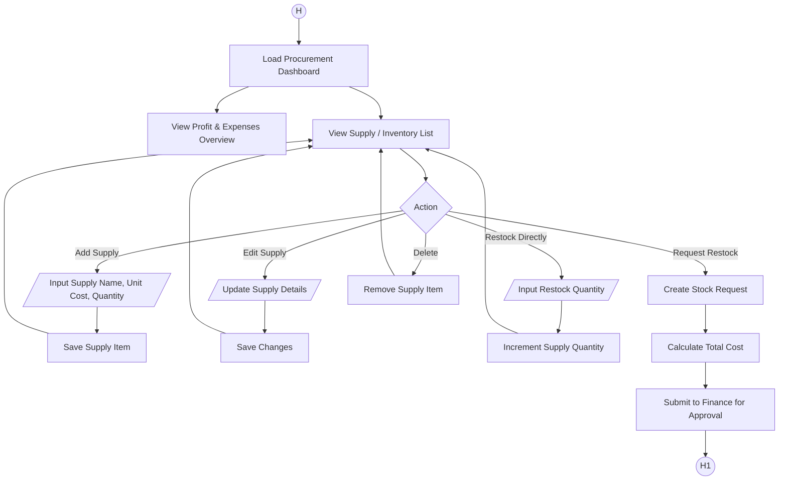
```mermaid
flowchart TD
    H((H)) --> ProcDash[Load Procurement Dashboard]
    ProcDash --> ViewFin[View Profit & Expenses Overview]
    ProcDash --> ViewSupply[View Supply / Inventory List]

    ViewSupply --> SupplyAction{Action}
    SupplyAction -->|Add Supply| AddSupply[/Input Supply Name, Unit Cost, Quantity/]
    AddSupply --> SaveSupply[Save Supply Item]
    SaveSupply --> ViewSupply

    SupplyAction -->|Edit Supply| EditSupply[/Update Supply Details/]
    EditSupply --> UpdateSupply[Save Changes]
    UpdateSupply --> ViewSupply

    SupplyAction -->|Restock Directly| DirectRestock[/Input Restock Quantity/]
    DirectRestock --> IncQty[Increment Supply Quantity]
    IncQty --> ViewSupply

    SupplyAction -->|Request Restock| RequestRestock[Create Stock Request]
    RequestRestock --> CalcCost[Calculate Total Cost]
    CalcCost --> SubmitReq[Submit to Finance for Approval]
    SubmitReq --> H1((H1))

    SupplyAction -->|Delete| DelSupply[Remove Supply Item]
    DelSupply --> ViewSupply
```

---

## XVI. STOCK REQUEST PIPELINE (Start H1)

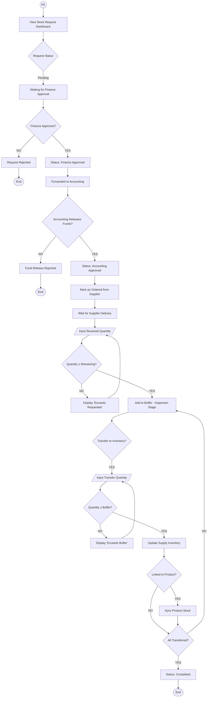
```mermaid
flowchart TD
    H1((H1)) --> ReqDash[View Stock Request Dashboard]
    ReqDash --> ReqStatus{Request Status}

    ReqStatus -->|Pending| WaitFin[Waiting for Finance Approval]
    WaitFin --> FinDecision{Finance Approves?}
    FinDecision -- NO --> FinReject[Request Rejected]
    FinReject --> End16([End])
    FinDecision -- YES --> FinApproved[Status: Finance Approved]

    FinApproved --> WaitAcc[Forwarded to Accounting]
    WaitAcc --> AccDecision{Accounting Releases Funds?}
    AccDecision -- NO --> AccReject[Fund Release Rejected]
    AccReject --> End17([End])
    AccDecision -- YES --> FundsReleased[Status: Accounting Approved]

    FundsReleased --> MarkOrdered[Mark as Ordered from Supplier]
    MarkOrdered --> WaitDelivery[Wait for Supplier Delivery]

    WaitDelivery --> ReceiveItems[/Input Received Quantity/]
    ReceiveItems --> QtyOk{Quantity ≤ Remaining?}
    QtyOk -- NO --> QtyErr2[Display 'Exceeds Requested']
    QtyErr2 --> ReceiveItems
    QtyOk -- YES --> Buffer[Add to Buffer - Inspection Stage]

    Buffer --> TransferAction{Transfer to Inventory?}
    TransferAction -- YES --> TransferQty[/Input Transfer Quantity/]
    TransferQty --> BufOk{Quantity ≤ Buffer?}
    BufOk -- NO --> BufErr[Display 'Exceeds Buffer']
    BufErr --> TransferQty
    BufOk -- YES --> UpdateInv[Update Supply Inventory]
    UpdateInv --> SyncProd{Linked to Product?}
    SyncProd -- YES --> SyncStock[Sync Product Stock]
    SyncProd -- NO --> CheckComplete
    SyncStock --> CheckComplete{All Transferred?}
    CheckComplete -- YES --> Complete[Status: Completed]
    Complete --> End18([End])
    CheckComplete -- NO --> Buffer
```

---

## XVII. ACCOUNTING — FUND RELEASE (Start I)

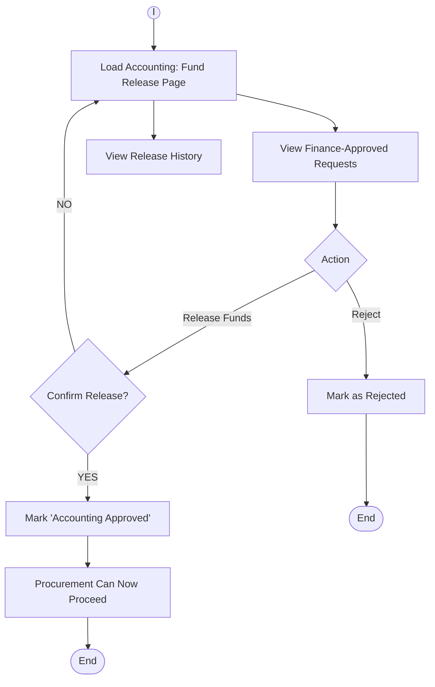
```mermaid
flowchart TD
    I((I)) --> AccPage[Load Accounting: Fund Release Page]
    AccPage --> ViewPending[View Finance-Approved Requests]
    AccPage --> ViewHistory[View Release History]

    ViewPending --> AccAction{Action}
    AccAction -->|Release Funds| ConfirmRel{Confirm Release?}
    ConfirmRel -- YES --> RelFunds[Mark 'Accounting Approved']
    RelFunds --> ProcNotify[Procurement Can Now Proceed]
    ProcNotify --> End19([End])

    AccAction -->|Reject| RejectRel[Mark as Rejected]
    RejectRel --> End20([End])

    ConfirmRel -- NO --> AccPage
```

---

## XVIII. FINANCE — BUDGET APPROVAL (Handled by Procurement)

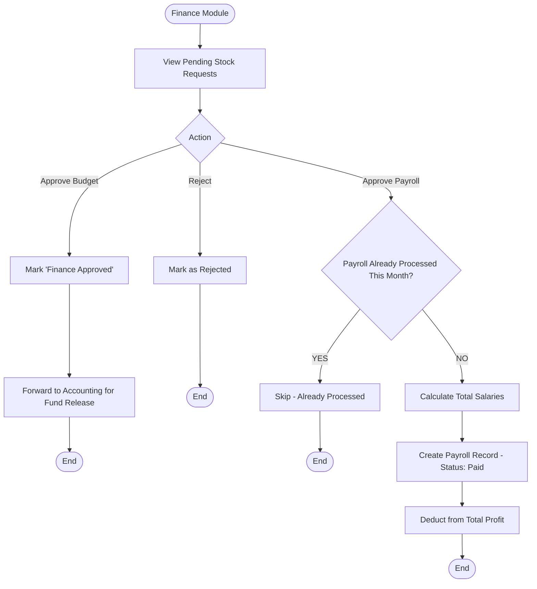
```mermaid
flowchart TD
    FinStart([Finance Module]) --> ViewReqs[View Pending Stock Requests]
    ViewReqs --> FinAction{Action}

    FinAction -->|Approve Budget| AppBudget[Mark 'Finance Approved']
    AppBudget --> ForwardAcc[Forward to Accounting for Fund Release]
    ForwardAcc --> End21([End])

    FinAction -->|Reject| RejBudget[Mark as Rejected]
    RejBudget --> End22([End])

    FinAction -->|Approve Payroll| PayrollCheck{Payroll Already Processed This Month?}
    PayrollCheck -- YES --> AlreadyPaid[Skip - Already Processed]
    AlreadyPaid --> End23([End])
    PayrollCheck -- NO --> CalcPayroll[Calculate Total Salaries]
    CalcPayroll --> ProcessPay[Create Payroll Record - Status: Paid]
    ProcessPay --> DeductProfit[Deduct from Total Profit]
    DeductProfit --> End24([End])
```

---

## XIX. HR / STAFF MANAGEMENT (Start J)

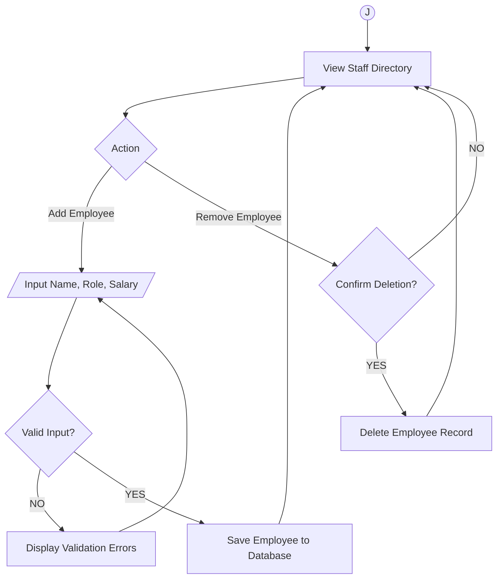
```mermaid
flowchart TD
    J((J)) --> StaffList[View Staff Directory]
    StaffList --> HRAction{Action}

    HRAction -->|Add Employee| EmpForm[/Input Name, Role, Salary/]
    EmpForm --> EmpValid{Valid Input?}
    EmpValid -- NO --> EmpErr[Display Validation Errors]
    EmpErr --> EmpForm
    EmpValid -- YES --> SaveEmp[Save Employee to Database]
    SaveEmp --> StaffList

    HRAction -->|Remove Employee| ConfirmDel{Confirm Deletion?}
    ConfirmDel -- YES --> DeleteEmp[Delete Employee Record]
    DeleteEmp --> StaffList
    ConfirmDel -- NO --> StaffList
```

---

## XX. SUPER ADMIN — PLATFORM MANAGEMENT (Start K)

```mermaid
flowchart TD
    K((K)) --> AdminDash[Load Super Admin Dashboard]
    AdminDash --> ViewMetrics[View Platform Metrics: Users, Orders, Revenue]
    AdminDash --> AdminNav{Navigate To}

    AdminNav -->|User Management| UserList[View All Users with Filters]
    AdminNav -->|Pending Artisans| PendList[View Pending Artisan Applications]

    PendList --> ReviewApp{Review Application}
    ReviewApp -->|View Details| ViewDocs[Review Uploaded Documents & ID]
    ViewDocs --> ApproveDecision{Approve Artisan?}

    ApproveDecision -- YES --> ApproveArt[Set Status: Approved]
    ApproveArt --> SendApprovalEmail[Send Approval Email]
    SendApprovalEmail --> End25([End])

    ApproveDecision -- NO --> InputReason[/Input Rejection Reason/]
    InputReason --> RejectArt[Set Status: Rejected]
    RejectArt --> SendRejectEmail[Send Rejection Email with Reason]
    SendRejectEmail --> End26([End])
```

---

## XXI. CHAT SYSTEM

```mermaid
flowchart TD
    ChatStart([Open Chat]) --> LoadChat[Load Chat Interface]
    LoadChat --> SelectConvo{Select Conversation}
    SelectConvo --> ViewMsgs[View Message Thread]
    ViewMsgs --> SendMsg{Send Message?}
    SendMsg -- YES --> InputMsg[/Type Message/]
    InputMsg --> SaveMsg[Save & Send Message]
    SaveMsg --> MarkSeen[Mark Messages as Seen]
    MarkSeen --> ViewMsgs
    SendMsg -- NO --> End27([End])
```

---

## XXII. NOTIFICATIONS

```mermaid
flowchart TD
    NotifStart([Open Notifications]) --> LoadNotif[Load Notifications List]
    LoadNotif --> NotifAction{Action}
    NotifAction -->|Read Notification| MarkRead[Mark as Read]
    MarkRead --> LoadNotif
    NotifAction -->|Mark All Read| ReadAll[Mark All as Read]
    ReadAll --> LoadNotif
    NotifAction -->|Delete Notification| DelNotif[Delete Single Notification]
    DelNotif --> LoadNotif
    NotifAction -->|Clear All| ClearAll[Delete All Notifications]
    ClearAll --> End28([End])
```

---

## MASTER CONNECTOR REFERENCE

| Connector | Module | Description |
|-----------|--------|-------------|
| **A** | Login | Standard + Social authentication entry |
| **A1** | Password Recovery | Forgot password flow |
| **B** | Buyer Registration | New buyer account creation |
| **C** | Artisan Registration | Seller application with admin approval |
| **D** | Shop Browsing | Public product catalog |
| **D1** | Cart Management | Add/update/remove cart items |
| **D2** | Checkout | Order placement with address & payment |
| **D3** | Payment Gateway | PayMongo integration |
| **E** | Buyer Home | Buyer navigation hub |
| **E1** | My Orders | Buyer order tracking & lifecycle |
| **E2** | Reviews | Product rating & review submission |
| **F** | Seller Dashboard | Seller navigation hub |
| **G** | Order Management | Seller order processing |
| **G1** | Product Management | CRUD for products |
| **H** | Procurement | Inventory & supply management |
| **H1** | Stock Requests | Full restock pipeline |
| **I** | Accounting | Fund release module |
| **J** | HR | Staff directory management |
| **K** | Super Admin | Platform-wide management |
