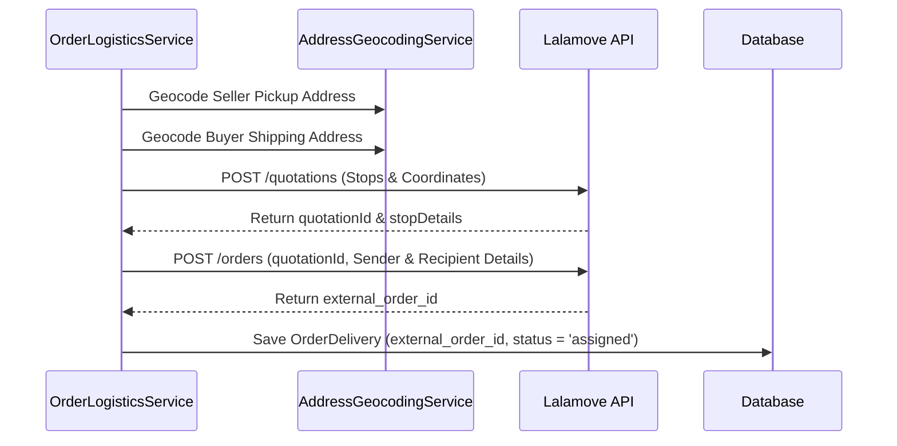

# External Integrations & Webhooks

This document outlines the operational flows, validation rules, and webhook behaviors for PayMongo (payments) and Lalamove (logistics) integrations.

---

## 1. PayMongo Payment Gateway

*   **Service Class**: [PayMongoService.php](file:///c:/laragon/www/LikhangKamay/app/Services/PayMongoService.php)
*   **Documentation Link**: [PayMongo API Reference](https://developers.paymongo.com/docs)

### Core Functions
*   `createCheckoutSession(array $data)`: Initiates a new payment session on PayMongo's server and returns the checkout session payload.
*   `retrieveCheckoutSession($sessionId)`: Resolves an active session to query payment details.

### Security & Business Constraints
1.  **Minimum Limit Constraint**: 
    > [!IMPORTANT]
    > PayMongo Checkout API has a strict minimum limit requirement of **₱100.00** (~10000 centavos). Attempting to check out transactions below this amount will fail.
2.  **Defensive Programming Wrappers**:
    All payment creation flows must be wrapped inside `try-catch` blocks to capture API execution errors cleanly without crashing the user session.
3.  **Db-Backed Status Verification**:
    Never trust raw frontend triggers or simple session identifiers. Always run a backend lookup against checkout records to verify paid states before updating order statuses to `Accepted`.

### Webhook & Signature Verification
*   **Webhook Controller**: [PaymongoWebhookController.php](file:///c:/laragon/www/LikhangKamay/app/Http/Controllers/Webhooks/PaymongoWebhookController.php)
*   **Endpoint Route**: POST `/webhooks/paymongo` (exempt from CSRF in `bootstrap/app.php`).
*   **Signature Security**:
    > [!IMPORTANT]
    > To prevent webhook spoofing attacks, all requests are validated using the `Paymongo-Signature` header against the HMAC SHA-256 secret configured in `config('services.paymongo.webhook_secret')`. Unauthorized payloads receive a `401 Unauthorized` response.

---

## 2. Lalamove Delivery Service

*   **Service Class**: [LalamoveService.php](file:///c:/laragon/www/LikhangKamay/app/Services/LalamoveService.php)
*   **Logistics Coordinator**: [OrderLogisticsService.php](file:///c:/laragon/www/LikhangKamay/app/Services/OrderLogisticsService.php)

### Delivery Booking Lifecycle

### Key Validation & Optimization Checks
*   **Method Check**: Lalamove is exclusively utilized for orders where `shipping_method === 'Delivery'`. Pickup/COD-only orders bypass this flow.
*   **State Check**: Only orders currently marked as `Accepted` (after payment confirmation) can be booked with Lalamove.
*   **Junction Check**: The buyer and seller address coordinate checks are geocoded using [AddressGeocodingService.php](file:///c:/laragon/www/LikhangKamay/app/Services/AddressGeocodingService.php) (Nominatim API). The system fails if both coordinates resolve to the same point.
*   **Double Geocoding Prevention**:
    In the event of a Lalamove API quotation or driver booking failure, the fallback geocoder in [CheckoutShippingService.php](file:///c:/laragon/www/LikhangKamay/app/Services/CheckoutShippingService.php) reuses any coordinates already fetched rather than making redundant Nominatim requests. This preserves OpenStreetMap API usage thresholds.
*   **Asynchronous Dashboard Status Sync**:
    To avoid 504 serverless function execution timeouts during dashboard loading, active shipment polling is deferred to the background queue via [SyncOrderDeliveryJob.php](file:///c:/laragon/www/LikhangKamay/app/Jobs/SyncOrderDeliveryJob.php).

---

## 3. Lalamove Webhook Receiver

*   **Webhook Controller**: [LalamoveWebhookController.php](file:///c:/laragon/www/LikhangKamay/app/Http/Controllers/Webhooks/LalamoveWebhookController.php)
*   **Endpoint Route**: Post route defined in [web.php](file:///c:/laragon/www/LikhangKamay/routes/web.php) (exempt from CSRF verification in [app.php](file:///c:/laragon/www/LikhangKamay/bootstrap/app.php)).

### Security Validation
*   Validates the incoming query string parameter `token` against the application's configured secret:
    `config('services.lalamove.webhook_secret')`
*   Rejects requests with a `419` / `401 Unauthorized` response if the token is missing or incorrect.

### Fault Tolerance
If the webhook processing throws a server-side exception (e.g., database lock or temporary service failure), the controller catches the error, logs it, and returns a standard `200 OK` response.
> [!NOTE]
> Returning `200 OK` on processing failure is intentional. It prevents the Lalamove server from initiating infinite webhook payload retries, which would flood the system logs.
