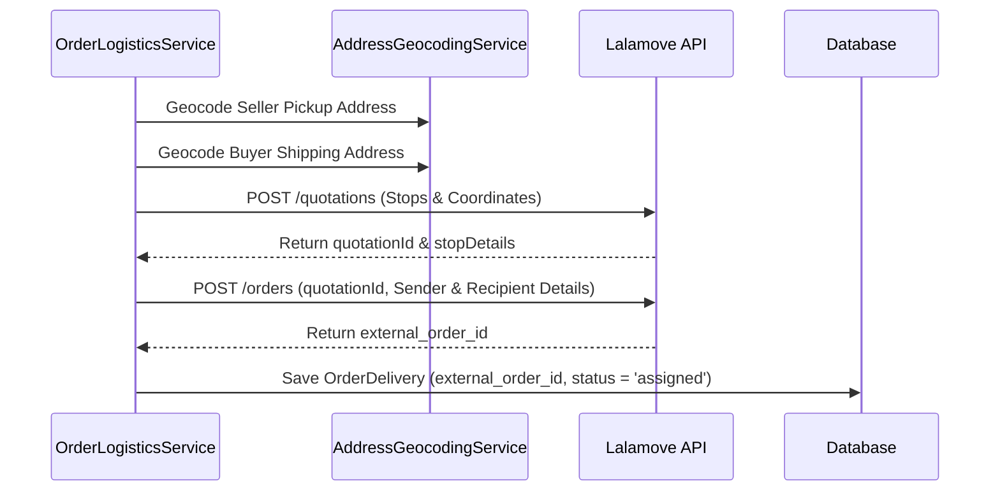

# External Integrations & Webhooks

This document outlines the operational flows, validation rules, and webhook behaviors for PayMongo (payments) and Lalamove (logistics) integrations.

---

## 1. PayMongo Payment Gateway

*   **Service Class**: [PayMongoService.php](file:///c:/laragon/www/LikhangKamay/app/Services/PayMongoService.php)
*   **Documentation Link**: [PayMongo API Reference](https://developers.paymongo.com/docs)

### Core Functions
*   `createCheckoutSession(array $data)`: Initiates a new payment session on PayMongo's server and returns the checkout session payload.
*   `retrieveCheckoutSession($sessionId)`: Resolves an active session to query payment details.

### Security & Business Constraints
1.  **Minimum Limit Constraint**: 
    > [!IMPORTANT]
    > PayMongo Checkout API has a strict minimum limit requirement of **₱100.00** (~10000 centavos). Attempting to check out transactions below this amount will fail.
2.  **Defensive Programming Wrappers**:
    All payment creation flows must be wrapped inside `try-catch` blocks to capture API execution errors cleanly without crashing the user session.
3.  **Db-Backed Status Verification**:
    Never trust raw frontend triggers or simple session identifiers. Always run a backend lookup against checkout records to verify paid states before updating order statuses to `Accepted`.

### Webhook & Signature Verification
*   **Webhook Controller**: [PaymongoWebhookController.php](file:///c:/laragon/www/LikhangKamay/app/Http/Controllers/Webhooks/PaymongoWebhookController.php)
*   **Endpoint Route**: POST `/webhooks/paymongo` (exempt from CSRF in `bootstrap/app.php`).
*   **Signature Security**:
    > [!IMPORTANT]
    > To prevent webhook spoofing attacks, all requests are validated using the `Paymongo-Signature` header against the HMAC SHA-256 secret configured in `config('services.paymongo.webhook_secret')`. Unauthorized payloads receive a `401 Unauthorized` response.

---

## 2. Lalamove Delivery Service

*   **Service Class**: [LalamoveService.php](file:///c:/laragon/www/LikhangKamay/app/Services/LalamoveService.php)
*   **Logistics Coordinator**: [OrderLogisticsService.php](file:///c:/laragon/www/LikhangKamay/app/Services/OrderLogisticsService.php)

### Delivery Booking Lifecycle

```mermaid
sequenceDiagram
    participant App as OrderLogisticsService
    participant Geo as AddressGeocodingService
    participant LL as Lalamove API
    participant DB as Database

    App->>Geo: Geocode Seller Pickup Address
    App->>Geo: Geocode Buyer Shipping Address
    App->>LL: POST /quotations (Stops & Coordinates)
    LL-->>App: Return quotationId & stopDetails
    App->>LL: POST /orders (quotationId, Sender & Recipient Details)
    LL-->>App: Return external_order_id
    App->>DB: Save OrderDelivery (external_order_id, status = 'assigned')
```

### Key Validation & Optimization Checks
*   **Method Check**: Lalamove is exclusively utilized for orders where `shipping_method === 'Delivery'`. Pickup/COD-only orders bypass this flow.
*   **State Check**: Only orders currently marked as `Accepted` (after payment confirmation) can be booked with Lalamove.
*   **Junction Check**: The buyer and seller address coordinate checks are geocoded using [AddressGeocodingService.php](file:///c:/laragon/www/LikhangKamay/app/Services/AddressGeocodingService.php) (Nominatim API). The system fails if both coordinates resolve to the same point.
*   **Double Geocoding Prevention**:
    In the event of a Lalamove API quotation or driver booking failure, the fallback geocoder in [CheckoutShippingService.php](file:///c:/laragon/www/LikhangKamay/app/Services/CheckoutShippingService.php) reuses any coordinates already fetched rather than making redundant Nominatim requests. This preserves OpenStreetMap API usage thresholds.
*   **Asynchronous Dashboard Status Sync**:
    To avoid 504 serverless function execution timeouts during dashboard loading, active shipment polling is deferred to the background queue via [SyncOrderDeliveryJob.php](file:///c:/laragon/www/LikhangKamay/app/Jobs/SyncOrderDeliveryJob.php).

---

## 3. Lalamove Webhook Receiver

*   **Webhook Controller**: [LalamoveWebhookController.php](file:///c:/laragon/www/LikhangKamay/app/Http/Controllers/Webhooks/LalamoveWebhookController.php)
*   **Endpoint Route**: Post route defined in [web.php](file:///c:/laragon/www/LikhangKamay/routes/web.php) (exempt from CSRF verification in [app.php](file:///c:/laragon/www/LikhangKamay/bootstrap/app.php)).

### Security Validation
*   Validates the incoming query string parameter `token` against the application's configured secret:
    `config('services.lalamove.webhook_secret')`
*   Rejects requests with a `419` / `401 Unauthorized` response if the token is missing or incorrect.

### Fault Tolerance
If the webhook processing throws a server-side exception (e.g., database lock or temporary service failure), the controller catches the error, logs it, and returns a standard `200 OK` response.
> [!NOTE]
> Returning `200 OK` on processing failure is intentional. It prevents the Lalamove server from initiating infinite webhook payload retries, which would flood the system logs.

---

## 4. Production Webhooks & Maintenance

### Migration Webhook (`/webhooks/migrate`)
*   **Route**: `GET /webhooks/migrate` (defined in [web.php](file:///c:/laragon/www/LikhangKamay/routes/web.php)).
*   **Purpose**: Allows running `php artisan migrate --force` securely on serverless host environments (such as Vercel).
*   **Authorization Modes**:
    1. Query secret matching `CRON_SECRET` environment variable (`?secret=<CRON_SECRET>`).
    2. Authenticated `super_admin` or `artisan` user session.
    3. Emergency migration key parameter (`?secret=likhangkamay_migrate_2026`).
*   **Response Format**: Returns JSON payload with migration output and structured error reports.

### Background Queue Worker Webhook (`/webhooks/cron/queue`)
*   **Route**: `GET /webhooks/cron/queue` (defined in [web.php](file:///c:/laragon/www/LikhangKamay/routes/web.php)).
*   **Security Header**: Validates `X-Vercel-Cron-Secret` against `CRON_SECRET`.
*   **Execution**: Dispatches `queue:work --stop-when-empty --max-time=50` to process queued notifications, mailings, and async tasks without blocking HTTP serverless requests.

---

## 5. Real-Time Synchronization & Resilient Fallbacks

LikhangKamay uses a dual-layer real-time architecture to deliver live updates seamlessly across both local (Laragon/MySQL) and production (Vercel serverless / PostgreSQL).

### Client Hook & Component Topology
*   **Global Listener**: [useRealtime.js](file:///c:/laragon/www/LikhangKamay/resources/js/hooks/useRealtime.js) (included in `AuthenticatedLayout`, `AdminLayout`, and `BuyerNavbar`).
*   **Chat Hook**: [useEchoConnection.js](file:///c:/laragon/www/LikhangKamay/resources/js/hooks/useEchoConnection.js), [useTeamChatEcho.js](file:///c:/laragon/www/LikhangKamay/resources/js/hooks/useTeamChatEcho.js).

### Protocol & Fallback Strategy
1.  **Primary Channel (Supabase & WebSockets)**:
    *   Listens for `postgres_changes` on the `notifications` and `orders` tables.
    *   Listens for private chat broadcasts via Laravel Echo (`chat.{id}`, `team-chat.{id}`).
2.  **Continuous Heartbeat Fallback**:
    *   If Supabase or Echo WebSockets disconnect, timeout, or error, the client automatically starts a background synchronization heartbeat (2.5s on active conversations, 4s on inboxes, and 5s on dashboards/orders/ERP modules).
3.  **Instant Window Focus Synchronization**:
    *   Whenever the user refocuses the window or switches back to the browser tab (`visibilitychange` / `focus`), an immediate sync request updates notification badges and counters without page refreshes.
4.  **Cross-Database JSON Compatibility**:
    *   The `notifications.data` column uses native `jsonb` on PostgreSQL and `json` on MySQL, allowing robust JSON path filters (`data->sender_id`) without syntax errors.
