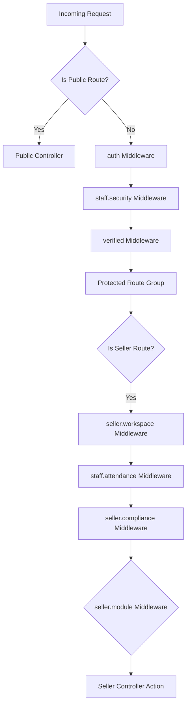

# Routing & Access Control Topography

This document details the routing layout, access middleware structure, and security controls used in LikhangKamay.

---

## 1. Routing Entrypoints

All routes are grouped within specific entrypoint files:
*   [web.php](file:///c:/laragon/www/LikhangKamay/routes/web.php): Main web application routes, including guest views, protected user spaces, and seller dashboards.
*   [auth.php](file:///c:/laragon/www/LikhangKamay/routes/auth.php): Authentication handling, register/login forms, password management, and staff login gates.

---

## 2. Authentication & Middleware Pipeline

LikhangKamay uses nested middleware groups to enforce granular access control.

### Core Middleware Descriptions
1.  `auth`: Enforces active user sessions.
2.  `staff.security`: Orchestrates specialized security checks and confirmation logouts for staff users. Backed by [EnsureStaffSecurityGate.php](file:///c:/laragon/www/LikhangKamay/app/Http/Middleware/EnsureStaffSecurityGate.php) and [StaffSecurityController.php](file:///c:/laragon/www/LikhangKamay/app/Http/Controllers/Auth/StaffSecurityController.php).
3.  `seller.workspace`: Groups routes specifically owned by Artisans/Sellers. Backed by [EnsureSellerWorkspaceAccess.php](file:///c:/laragon/www/LikhangKamay/app/Http/Middleware/EnsureSellerWorkspaceAccess.php).
4.  `staff.attendance`: Validates that staff checking into the workspace have active attendance sessions. Backed by [EnsureStaffAttendanceActive.php](file:///c:/laragon/www/LikhangKamay/app/Http/Middleware/EnsureStaffAttendanceActive.php).
5.  `seller.compliance`: Ensures the seller has agreed to compliance and active terms. Backed by [EnsureSellerCompliance.php](file:///c:/laragon/www/LikhangKamay/app/Http/Middleware/EnsureSellerCompliance.php).
6.  `seller.module:{module_name}`: Enforces granular feature toggles. Users can only access modules enabled in their dashboard configuration. Backed by [EnsureSellerModuleAccess.php](file:///c:/laragon/www/LikhangKamay/app/Http/Middleware/EnsureSellerModuleAccess.php).
7.  `EnsureArtisan`: Verifies the user's role is strictly `artisan`. Backed by [EnsureArtisan.php](file:///c:/laragon/www/LikhangKamay/app/Http/Middleware/EnsureArtisan.php).
8.  `EnsureSuperAdmin`: Validates platform administrators. Backed by [EnsureSuperAdmin.php](file:///c:/laragon/www/LikhangKamay/app/Http/Middleware/EnsureSuperAdmin.php).
9.  `HandleInertiaRequests`: Injects shared React frontend state and props. Backed by [HandleInertiaRequests.php](file:///c:/laragon/www/LikhangKamay/app/Http/Middleware/HandleInertiaRequests.php).
10. `SecurityHeaders` & `XssSanitization`: Enforces CSP headers and request payload security filtering. Backed by [SecurityHeaders.php](file:///c:/laragon/www/LikhangKamay/app/Http/Middleware/SecurityHeaders.php) and [XssSanitization.php](file:///c:/laragon/www/LikhangKamay/app/Http/Middleware/XssSanitization.php).
11. `CheckMaintenanceMode`: Standard Laravel maintenance wall. Backed by [CheckMaintenanceMode.php](file:///c:/laragon/www/LikhangKamay/app/Http/Middleware/CheckMaintenanceMode.php).
12. `EnsureNotBanned`: Automatically terminates active sessions and blocks login attempts for suspended users or staff. Backed by [EnsureNotBanned.php](file:///c:/laragon/www/LikhangKamay/app/Http/Middleware/EnsureNotBanned.php).

---

## 3. Route Groups & Modules

### Public Marketplace
*   **Search and Filters**: `/shop` (bound to `throttle:marketplace.search` rate limit).
*   **Artisan Page**: `/shop/{user:shop_slug}`
*   **Product View**: `/product/{product}`

### Seller Management Modules
Protected under `seller.workspace` and feature-toggled via `seller.module`:
*   **Orders Dashboard**: `/orders` (Module: `orders`)
*   **Financial & Performance Analytics**: `/analytics` (Module: `analytics`)
*   **Inventory & Products**: `/products` (Module: `products`)
*   **3D Assets Manager**: `/3d-manager` (Module: `3d`)
*   **Human Resources & Payroll**: `/hr` (Module: `hr`)
*   **Procurement / Restocking**: `/procurement` (Module: `procurement`)

---

## 4. Access Control Rules

1.  **Policies & Gates Mandate**:
    > [!IMPORTANT]
    > All controller actions must check authorization via Laravel Policies and Gates (`Gate::authorize`). Inline role checks (e.g., `$user->role === 'admin'`) are forbidden inside controllers.
    *   **Core Policies**:
        *   [ProductPolicy.php](file:///c:/laragon/www/LikhangKamay/app/Policies/ProductPolicy.php): Validates artisan listing edits.
        *   [StockRequestPolicy.php](file:///c:/laragon/www/LikhangKamay/app/Policies/StockRequestPolicy.php): Authorizes inventory requests.
        *   [PayrollPolicy.php](file:///c:/laragon/www/LikhangKamay/app/Policies/PayrollPolicy.php): Restricts salary approval views.
        *   [AdminPolicy.php](file:///c:/laragon/www/LikhangKamay/app/Policies/AdminPolicy.php): Restricts platform variable settings.
2.  **Controller Size Constraint**:
    All controller methods must remain thin (under 50 lines). Complex logic must be delegated to dedicated backend Service layers (e.g., `CatalogService`, `AccountingLedgerService`).

### Route Safety & Obfuscation
*   [RouteObfuscator.php](file:///c:/laragon/www/LikhangKamay/app/Support/RouteObfuscator.php): Secures public and private resource routing by obfuscating sensitive database IDs in URLs to prevent scraping and enumeration attacks.

### Auth & Settings Services & Facades
*   [AuthRedirectService.php](file:///c:/laragon/www/LikhangKamay/app/Services/AuthRedirectService.php): Handles custom redirect behaviors for different user role classifications upon authentication.
*   [EmailVerificationCodeService.php](file:///c:/laragon/www/LikhangKamay/app/Services/EmailVerificationCodeService.php): Manages generation, throttling, and verification validation checks for registration security.
*   [SystemSettingsService.php](file:///c:/laragon/www/LikhangKamay/app/Services/SystemSettingsService.php): Orchestrates read and write operations for global site variables.
*   [Settings.php](file:///c:/laragon/www/LikhangKamay/app/Facades/Settings.php): Global settings facade simplifying access to system settings.

---

## 5. Application Boot & Rate Limiting

The initialization and bootstrap configurations are run within [AppServiceProvider.php](file:///c:/laragon/www/LikhangKamay/app/Providers/AppServiceProvider.php):

*   **Super Admin Bypass**: Explicitly authorizes admins for all gates:
    `Gate::before(fn ($user) => $user->isAdmin() ? true : null)`
*   **Production Vercel Storage Fix**: Diverts Compiled Blade views to the writable serverless directory `/tmp/storage/framework/views` when running on production environment.
*   **Password Complexity Default Rules**: Sets a strict password limit (minimum 12 chars, mixedCase, numbers, symbols, uncompromised validation check) on production.
*   **Configured Rate Limiters**:
    1.  `marketplace.search`: Caps search requests at 30 per minute per IP.
    2.  `bulk.ops`: Caps heavy bulk operations (CSV exports) at 5 per minute.
    3.  `admin.heavy`: Caps analytics rendering queries at 10 per minute.
    4.  `login`: Enforces brute force defense, capping login attempts to 5 per minute per IP.
    5.  `forgot-password` (`throttle:3,1`): Restricts reset request emails to 3 per minute per IP.
    6.  `validate-active` (`throttle:60,1`): Limits local storage validation lookups to 60 per minute per IP.
    7.  `complete-profile` (`throttle:5,1`): Restricts social profile finalization requests to 5 per minute per IP.
