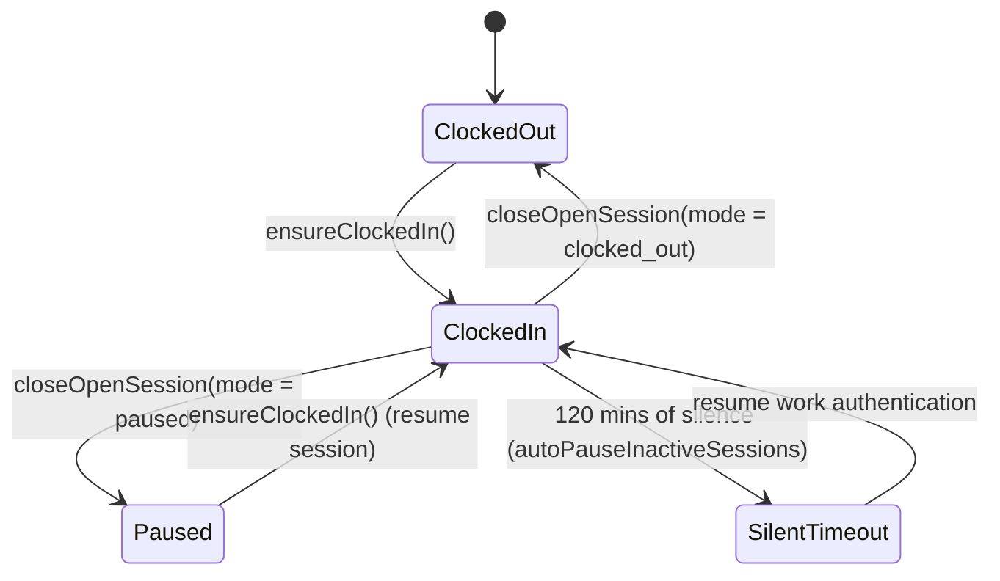

# ERP: HR & Attendance

This document details the employee payroll formulas, clock-in/clock-out lifecycle, and the auto-pause/heartbeat system for staff attendance.

---

## 1. Domain Models

*   **Employee Model**: [Employee.php](file:///c:/laragon/www/LikhangKamay/app/Models/Employee.php)
    *   Tracks physical team members working under a seller owner.
    *   Fields: `employee_id`, `name`, `role`, `salary` (basic daily or hourly wage), `status`, `join_date`.
*   **Staff Attendance Session**: [StaffAttendanceSession.php](file:///c:/laragon/www/LikhangKamay/app/Models/StaffAttendanceSession.php)
    *   Represents a continuous period of active work.
    *   Fields: `clock_in_at`, `clock_out_at`, `worked_minutes`, `close_mode`, `close_reason`, `last_heartbeat_at`, `last_activity_at`.
*   **Payroll & Payroll Item**: [Payroll.php](file:///c:/laragon/www/LikhangKamay/app/Models/Payroll.php) | [PayrollItem.php](file:///c:/laragon/www/LikhangKamay/app/Models/PayrollItem.php)
    *   Represents monthly salary computations and individual payouts.

---

## 2. Staff Attendance Lifecycle

Staff sessions are managed by [StaffAttendanceService.php](file:///c:/laragon/www/LikhangKamay/app/Services/StaffAttendanceService.php):

### Inactivity & Heartbeat Guard
*   **Heartbeat Frequency**: Every 60 seconds (`HEARTBEAT_INTERVAL_SECONDS = 60`), the frontend sends a ping to update the `last_heartbeat_at` field.
*   **Auto-Pause Triggers**:
    If a session has no heartbeat or activity for 120 minutes (`autoPauseInactiveSessions`), the session is automatically closed.
    *   **Past Days Capping**: If a session remains unclosed from a past day, it is retroactively closed, capping its length at the last recorded sign of life + 15 minutes.
    *   **Resume Work Gate**: Closed timeout sessions set `close_reason = inactivity_timeout`. When the user attempts to click a dashboard module, they are blocked by a **Resume Prompt** overlay until they authenticate.

---

## 3. Payroll Calculations

Formula logic is orchestrated by [HRController.php](file:///c:/laragon/www/LikhangKamay/app/Http/Controllers/Seller/HRController.php):

*   **Standard Workday**: 8 hours (480 minutes).
*   **Basic Salary Factor**:
    The system maps worked hours to salary based on the seller's configured basic pay rates.
*   **Overtime Multipliers**:
    *   Standard Overtime Rate: Basic rate $\times$ Overtime multiplier (e.g. 1.25x).
    *   Rest Day Overtime: Basic rate $\times$ Rest day OT multiplier (e.g. 1.5x).
    *   Holiday Overtime: Basic rate $\times$ Holiday OT multiplier (e.g. 2.0x).
*   **Balance Release Gate**:
    Like Stock Requests, Payroll releases require sufficient financial balance check in a database transaction with a lock on the seller user (`lockForUpdate`).

### Core Business Actions
*   [ProvisionStaffAccount.php](file:///c:/laragon/www/LikhangKamay/app/Actions/Seller/HR/ProvisionStaffAccount.php): Handles provisioning employee logins, binding them to the seller owner, and storing role permission mappings.

### HR Support Helpers
*   [HRWorkflowHelper.php](file:///c:/laragon/www/LikhangKamay/app/Support/HRWorkflowHelper.php): Helper utility automating employee shifts validation and overtime calculations.
*   [HRRolePresets.php](file:///c:/laragon/www/LikhangKamay/app/Support/HR/HRRolePresets.php): Defines system-wide role matrices and modular workspace privileges.
*   [HRStaffProvisioner.php](file:///c:/laragon/www/LikhangKamay/app/Support/HR/HRStaffProvisioner.php): Manages the mechanical creation and database persistence of new staff login records.
*   [HREmployeeLoader.php](file:///c:/laragon/www/LikhangKamay/app/Support/HR/HREmployeeLoader.php): Eager loads HR-specific relationships and capabilities for staff sessions.

### HR Domain Services
*   [PayrollCalculatorService.php](file:///c:/laragon/www/LikhangKamay/app/Services/HR/PayrollCalculatorService.php): Service executing the salary and overtime arithmetic for payroll runs.
*   [StaffAttendanceService.php](file:///c:/laragon/www/LikhangKamay/app/Services/StaffAttendanceService.php): Handles checking staff in/out, recording heartbeats, and timeout sweeps.

### ERP Controllers
*   [ProcurementController.php](file:///c:/laragon/www/LikhangKamay/app/Http/Controllers/Seller/ProcurementController.php), [StockRequestController.php](file:///c:/laragon/www/LikhangKamay/app/Http/Controllers/Seller/StockRequestController.php): Manages raw material procurement and seller supply resupply requests.
*   [StaffDashboardController.php](file:///c:/laragon/www/LikhangKamay/app/Http/Controllers/Seller/StaffDashboardController.php): Provides restricted widget dashboards for non-admin staff users.

### Stock & Procurement Mails & Notifications
*   [LowStockAlert.php](file:///c:/laragon/www/LikhangKamay/app/Mail/LowStockAlert.php): Dispatches inventory warnings to artisans.
*   [LowStockNotification.php](file:///c:/laragon/www/LikhangKamay/app/Notifications/LowStockNotification.php) | [LowStockWarningNotification.php](file:///c:/laragon/www/LikhangKamay/app/Notifications/LowStockWarningNotification.php): Dispatches in-app low stock alerts.
*   [SupplyDepletedNotification.php](file:///c:/laragon/www/LikhangKamay/app/Notifications/SupplyDepletedNotification.php): Alerts sellers when critical supplies run dry.
*   [AccountingApprovalRequestedNotification.php](file:///c:/laragon/www/LikhangKamay/app/Notifications/AccountingApprovalRequestedNotification.php) | [AccountingRejectedNotification.php](file:///c:/laragon/www/LikhangKamay/app/Notifications/AccountingRejectedNotification.php): Workflow notifications for stock requests.
