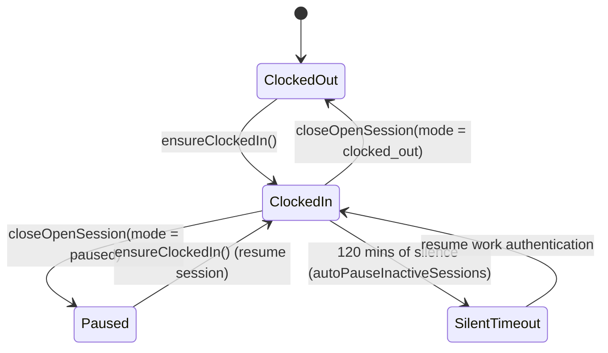

# ERP: HR & Attendance

This document details the employee payroll formulas, clock-in/clock-out lifecycle, and the auto-pause/heartbeat system for staff attendance.

---

## 1. Domain Models

*   **Employee Model**: [Employee.php](file:///c:/laragon/www/LikhangKamay/app/Models/Employee.php)
    *   Tracks physical team members working under a seller owner.
    *   Fields: `employee_id`, `name`, `role`, `salary` (basic daily or hourly wage), `status`, `join_date`.
*   **Staff Attendance Session**: [StaffAttendanceSession.php](file:///c:/laragon/www/LikhangKamay/app/Models/StaffAttendanceSession.php)
    *   Represents a continuous period of active work.
    *   Fields: `clock_in_at`, `clock_out_at`, `worked_minutes`, `close_mode`, `close_reason`, `last_heartbeat_at`, `last_activity_at`.
*   **Seller Location Model**: [SellerLocation.php](file:///c:/laragon/www/LikhangKamay/app/Models/SellerLocation.php)
    *   Represents physical shop/workshop workplace locations and geofence perimeters.
    *   Fields: `name`, `address`, `latitude`, `longitude`, `radius_meters`, `enforce_strict_geofence` (boolean toggle for hard-block vs soft-flagging), `is_active`.
*   **Payroll & Payroll Item**: [Payroll.php](file:///c:/laragon/www/LikhangKamay/app/Models/Payroll.php) | [PayrollItem.php](file:///c:/laragon/www/LikhangKamay/app/Models/PayrollItem.php)
    *   Represents monthly salary computations and individual payouts.

---

## 2. Staff Attendance Lifecycle

Staff sessions are managed by [StaffAttendanceService.php](file:///c:/laragon/www/LikhangKamay/app/Services/StaffAttendanceService.php):

```mermaid
stateDiagram-v2
    [*] --> ClockedOut
    ClockedOut --> ClockedIn : ensureClockedIn()
    ClockedIn --> Paused : closeOpenSession(mode = paused)
    Paused --> ClockedIn : ensureClockedIn() (resume session)
    ClockedIn --> SilentTimeout : 120 mins of silence (autoPauseInactiveSessions)
    SilentTimeout --> ClockedIn : resume work authentication
    ClockedIn --> ClockedOut : closeOpenSession(mode = clocked_out)
```

### Inactivity & Heartbeat Guard
*   **Heartbeat Frequency**: Every 60 seconds (`HEARTBEAT_INTERVAL_SECONDS = 60`), the frontend sends a ping to update the `last_heartbeat_at` field.
*   **Auto-Pause Triggers**:
    If a session has no heartbeat or activity for 120 minutes (`autoPauseInactiveSessions`), the session is automatically closed.
    *   **Past Days Capping**: If a session remains unclosed from a past day, it is retroactively closed, capping its length at the last recorded sign of life + 15 minutes.
    *   **Resume Work Gate**: Closed timeout sessions set `close_reason = inactivity_timeout`. When the user attempts to click a dashboard module, they are blocked by a **Resume Prompt** overlay until they authenticate.

---

## 3. Payroll Calculations

Formula logic is orchestrated by [HRController.php](file:///c:/laragon/www/LikhangKamay/app/Http/Controllers/Seller/HRController.php):

*   **Standard Workday**: 8 hours (480 minutes).
*   **Basic Salary Factor**:
    The system maps worked hours to salary based on the seller's configured basic pay rates.
*   **Overtime Multipliers**:
    *   Standard Overtime Rate: Basic rate $\times$ Overtime multiplier (e.g. 1.25x).
    *   Rest Day Overtime: Basic rate $\times$ Rest day OT multiplier (e.g. 1.5x).
    *   Holiday Overtime: Basic rate $\times$ Holiday OT multiplier (e.g. 2.0x).
*   **Balance Release Gate**:
    Like Stock Requests, Payroll releases require sufficient financial balance check in a database transaction with a lock on the seller user (`lockForUpdate`).

### Core Business Actions
*   [ProvisionStaffAccount.php](file:///c:/laragon/www/LikhangKamay/app/Actions/Seller/HR/ProvisionStaffAccount.php): Handles provisioning employee logins, binding them to the seller owner, and storing role permission mappings.

### Payroll Review & Audit UI Architecture
*   **Executive Metrics Header**: Displays 3 high-level metrics (`Total Payout`, `Staff Included`, `Net Treasury Impact`) and a treasury status pill in [PayrollReviewDetails.jsx](file:///c:/laragon/www/LikhangKamay/resources/js/Components/Seller/Accounting/PayrollReviewDetails.jsx).
*   **Employee Line Ledger**: Scannable tabular breakdown of Base Salary, Deductions, Overtime, and Net Payout.
*   **Calculation Audit Popover**: [PayrollCalculationModal.jsx](file:///c:/laragon/www/LikhangKamay/resources/js/Components/Seller/HR/PayrollCalculationModal.jsx) opens via an "Audit Formula" button per employee row to inspect daily/hourly formulas, overtime multipliers, and sub-totals.
*   **Container-Sticky Action Footer**: Rendered inline in [ReleaseRequestDetails.jsx](file:///c:/laragon/www/LikhangKamay/resources/js/Components/Seller/Accounting/ReleaseRequestDetails.jsx), dynamically docking to the bottom of the card container (`sticky bottom-4 z-20`) when auditing long employee lists.

### HR Support Helpers
*   [HRWorkflowHelper.php](file:///c:/laragon/www/LikhangKamay/app/Support/HRWorkflowHelper.php): Helper utility automating employee shifts validation and overtime calculations.
*   [HRRolePresets.php](file:///c:/laragon/www/LikhangKamay/app/Support/HR/HRRolePresets.php): Defines system-wide role matrices and modular workspace privileges.
*   [HRStaffProvisioner.php](file:///c:/laragon/www/LikhangKamay/app/Support/HR/HRStaffProvisioner.php): Manages the mechanical creation and database persistence of new staff login records.
*   [HREmployeeLoader.php](file:///c:/laragon/www/LikhangKamay/app/Support/HR/HREmployeeLoader.php): Eager loads HR-specific relationships and capabilities for staff sessions.

### HR Domain Services
*   [PayrollCalculatorService.php](file:///c:/laragon/www/LikhangKamay/app/Services/HR/PayrollCalculatorService.php): Service executing the salary and overtime arithmetic for payroll runs.
*   [AttendanceAggregatorService.php](file:///c:/laragon/www/LikhangKamay/app/Services/HR/AttendanceAggregatorService.php): Aggregates daily worked hours, overtime, and tardiness metrics for HR reports.
*   [StaffAttendanceService.php](file:///c:/laragon/www/LikhangKamay/app/Services/StaffAttendanceService.php): Handles checking staff in/out, recording heartbeats, timeout sweeps, and geofence validation (supports both soft-flagging manager approval and strict hard-blocking based on `enforce_strict_geofence`).

### ERP Controllers
*   [SellerLocationController.php](file:///c:/laragon/www/LikhangKamay/app/Http/Controllers/Seller/SellerLocationController.php): Manages workplace locations, GPS coordinates, geofence radius settings, and strict enforcement toggles.
*   [ProcurementController.php](file:///c:/laragon/www/LikhangKamay/app/Http/Controllers/Seller/ProcurementController.php), [StockRequestController.php](file:///c:/laragon/www/LikhangKamay/app/Http/Controllers/Seller/StockRequestController.php): Manages raw material procurement and seller supply resupply requests.
*   [StaffDashboardController.php](file:///c:/laragon/www/LikhangKamay/app/Http/Controllers/Seller/StaffDashboardController.php): Provides restricted widget dashboards for non-admin staff users.

---

## 4. Time-Card Audit Architecture

A dedicated full-page view is available for inspecting individual employee attendance records, shift selfie proof, GPS geofencing, and shift approvals.

*   **Route**: `GET /hr/employees/{employee}/time-card` (`hr.employees.time-card`)
*   **Controller Method**: `HRController::showTimeCardAudit` in [HRController.php](file:///c:/laragon/www/LikhangKamay/app/Http/Controllers/Seller/HRController.php)
*   **Frontend Inertia Page**: [TimeCardAudit.jsx](file:///c:/laragon/www/LikhangKamay/resources/js/Pages/Seller/HR/TimeCardAudit.jsx)
*   **UI Features**:
    *   **Header Banner**: Displays user avatar synced with `UserAvatar` component, employee ID, role badge, and assigned location.
    *   **Metric Summary Cards**: 4 key metrics (`Total Worked`, `Approved Overtime`, `Undertime / Tardy`, `Rest Day OT`).
    *   **Unified Single-Row Filter Toolbar**: Segmented status pills (`All`, `Pending Review`, `Off-Site`, `Approved`, `Rejected`), search input, and desktop floating dropdown popover (`isPopoverOpen`).
    *   **Descending Shift Date Sorting**: Displays latest shift dates at the top of the table/timeline list.
    *   **Geofence Verification & Selfie Proof**: Visual tags for `On-Site` vs `Off-Site` GPS distances and slide-up modal for selfie verification images.
    *   **Mobile-Native Adaptation**: Responsive coexistence (`hidden lg:block` data table vs `block lg:hidden` card list) with mobile bottom sheets (`SlideOverDrawer`).
    *   **Z-Index Stacking**: Uses global `Modal.jsx` at `z-[150]` ensuring complete overlay dimming across sticky headers and sidebars.

### Stock, HR & Procurement Mails & Notifications
*   [OffSiteClockInNotification.php](file:///c:/laragon/www/LikhangKamay/app/Notifications/OffSiteClockInNotification.php): Dispatches manager alerts when an employee clocks in outside approved geofence boundaries.
*   [LowStockAlert.php](file:///c:/laragon/www/LikhangKamay/app/Mail/LowStockAlert.php): Dispatches inventory warnings to artisans.
*   [LowStockNotification.php](file:///c:/laragon/www/LikhangKamay/app/Notifications/LowStockNotification.php) | [LowStockWarningNotification.php](file:///c:/laragon/www/LikhangKamay/app/Notifications/LowStockWarningNotification.php): Dispatches in-app low stock alerts.
*   [SupplyDepletedNotification.php](file:///c:/laragon/www/LikhangKamay/app/Notifications/SupplyDepletedNotification.php): Alerts sellers when critical supplies run dry.
*   [AccountingApprovalRequestedNotification.php](file:///c:/laragon/www/LikhangKamay/app/Notifications/AccountingApprovalRequestedNotification.php) | [AccountingRejectedNotification.php](file:///c:/laragon/www/LikhangKamay/app/Notifications/AccountingRejectedNotification.php): Workflow notifications for stock requests.

---

## 5. Employee Directory & Account Provisioning Security

*   **Search & Multi-Dimensional Filtering**:
    [StaffTable.jsx](file:///c:/laragon/www/LikhangKamay/resources/js/Components/Seller/HR/StaffTable.jsx) provides real-time memoized filtering across:
    *   **Keyword Search**: Queries against Employee Name, Employee ID, Role, and linked User Email.
    *   **Hire Date Range**: `From` and `To` date boundaries with flexbox constraints (`min-w-0 flex-1`) and custom webkit calendar picker indicator styling.
    *   **Module Entitlements**: Multi-select pills filtering by active permissions (`Catalog`, `Orders`, `HR`, `Procurement`, `Accounting`, `CRM`).
    *   **Employment & Login Status**: Segmented status tabs (`Active`, `On Leave`, `Terminated`, `With Portal Access`).
*   **Account Provisioning Security Guards**:
    *   [ProvisionStaffAccount.php](file:///c:/laragon/www/LikhangKamay/app/Actions/Seller/HR/ProvisionStaffAccount.php) and [HRStaffProvisioner.php](file:///c:/laragon/www/LikhangKamay/app/Support/HR/HRStaffProvisioner.php) enforce strict email uniqueness rules.
    *   Employees provisioned with login credentials cannot use an email already registered to any existing seller, buyer, or administrator, preventing privilege escalation and collision attacks.

