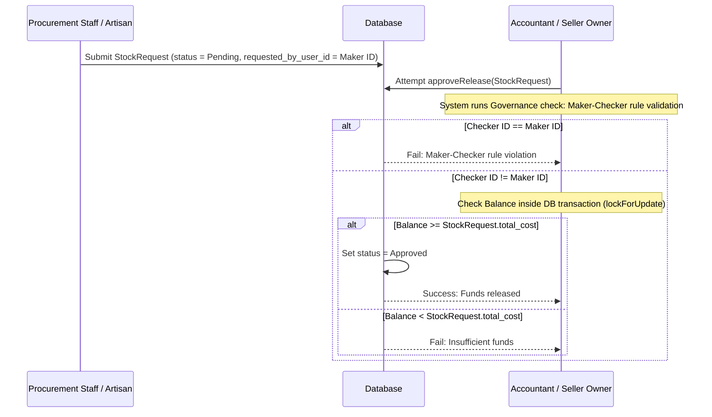

# ERP: Procurement & Inventory

This document outlines the workflows, schemas, and governance controls for restocking and managing inventory supplies.

---

## 1. Core Domain Models

*   **Supply Model**: [Supply.php](file:///c:/laragon/www/LikhangKamay/app/Models/Supply.php)
    *   Tracks physical raw materials (e.g., clay, glazes, tools) needed for ceramic production.
    *   Fields: `name`, `sku`, `category`, `stock` (available volume), `unit`, `unit_cost`, `reorder_level`.
*   **Stock Request Model**: [StockRequest.php](file:///c:/laragon/www/LikhangKamay/app/Models/StockRequest.php)
    *   Represents a formal request to purchase/restock raw supplies.
    *   Fields: `supply_id`, `requested_by_user_id`, `quantity`, `total_cost`, `status`, `rejection_reason`.
    *   Status constants:
        *   `STATUS_PENDING = 'Pending'`
        *   `STATUS_ACCOUNTING_APPROVED = 'Approved'`
        *   `STATUS_ORDERED = 'Ordered'`
        *   `STATUS_PARTIALLY_RECEIVED = 'Partially Received'`
        *   `STATUS_RECEIVED = 'Received'`
        *   `STATUS_COMPLETED = 'Completed'`
        *   `STATUS_REJECTED = 'Rejected'`
*   **Product Recipe Model**: [ProductRecipe.php](file:///c:/laragon/www/LikhangKamay/app/Models/ProductRecipe.php)
    *   Defines the raw materials (`Supply` items) and quantities required to produce one unit of a finished `Product`.
    *   Establishes the costing linkage where total recipe costs directly influence a product's base `cost_price`.

---

## 2. Procurement & Approval Lifecycle

The procurement flow relies on a strict maker-checker approval separation.



---

## 3. Governance: The Maker-Checker Rule

Implemented in [AccountingController.php](file:///c:/laragon/www/LikhangKamay/app/Http/Controllers/Seller/AccountingController.php):
```php
$actor = $this->sellerActor();
if ($stockRequest->requested_by_user_id && $stockRequest->requested_by_user_id === $actor->id) {
    return back()->with('error', 'Governance Control: Maker-Checker rule violation. You cannot approve a request you initiated.');
}
```
*   **Maker (Initiator)**: The staff member or artisan who creates the stock request.
*   **Checker (Approver)**: A separate accountant or the seller owner who reviews and releases the funds.
*   **Audit Notification**: When a request is rejected, the maker is notified via `AccountingRejectedNotification`.
