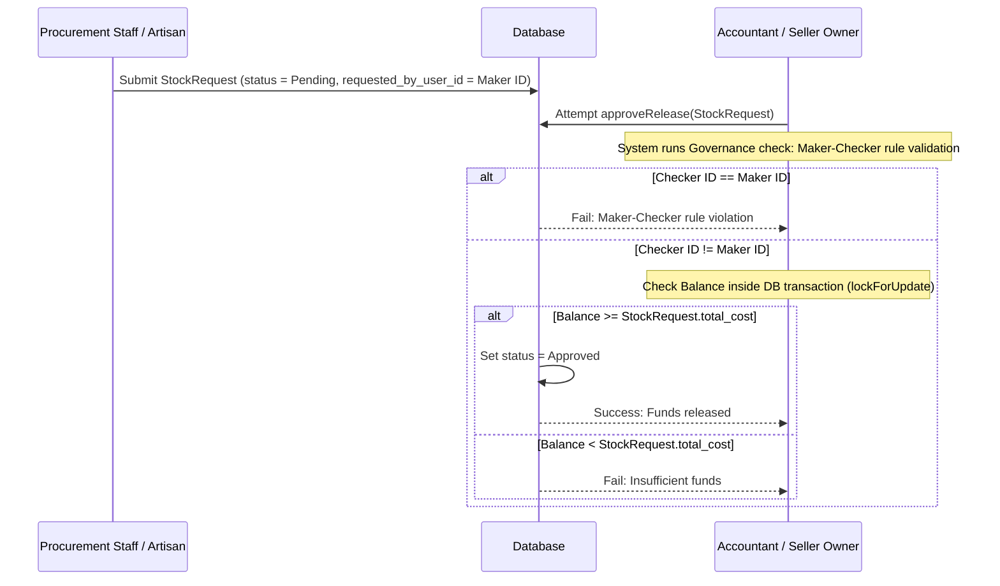

# ERP: Procurement & Inventory

This document outlines the workflows, schemas, and governance controls for restocking and managing inventory supplies.

---

## 1. Core Domain Models

*   **Supply Model**: [Supply.php](file:///c:/laragon/www/LikhangKamay/app/Models/Supply.php)
    *   Tracks physical raw materials (e.g., clay, glazes, tools) needed for ceramic production.
    *   Fields: `name`, `sku`, `category`, `stock` (available volume), `unit`, `unit_cost`, `reorder_level`.
*   **Stock Request Model**: [StockRequest.php](file:///c:/laragon/www/LikhangKamay/app/Models/StockRequest.php)
    *   Represents a formal request to purchase/restock raw supplies.
    *   Fields: `supply_id`, `requested_by_user_id`, `quantity`, `total_cost`, `status`, `rejection_reason`.
    *   Status constants:
        *   `STATUS_PENDING = 'Pending'`
        *   `STATUS_ACCOUNTING_APPROVED = 'Approved'`
        *   `STATUS_ORDERED = 'Ordered'`
        *   `STATUS_PARTIALLY_RECEIVED = 'Partially Received'`
        *   `STATUS_RECEIVED = 'Received'`
        *   `STATUS_COMPLETED = 'Completed'`
        *   `STATUS_REJECTED = 'Rejected'`
*   **Product Recipe Model**: [ProductRecipe.php](file:///c:/laragon/www/LikhangKamay/app/Models/ProductRecipe.php)
    *   Defines the raw materials (`Supply` items) and quantities required to produce one unit of a finished `Product`.
    *   Establishes the costing linkage where total recipe costs directly influence a product's base `cost_price`.

---

## 2. Procurement & Approval Lifecycle

The procurement flow relies on a strict maker-checker approval separation.


```mermaid
sequenceDiagram
    participant Maker as Procurement Staff / Artisan
    participant DB as Database
    participant Checker as Accountant / Seller Owner

    Maker->>DB: Submit StockRequest (status = Pending, requested_by_user_id = Maker ID)
    Checker->>DB: Attempt approveRelease(StockRequest)
    Note over Checker: System runs Governance check: Maker-Checker rule validation
    alt Checker ID == Maker ID
        DB-->>Checker: Fail: Maker-Checker rule violation
    else Checker ID != Maker ID
        Note over Checker: Check Balance inside DB transaction (lockForUpdate)
        alt Balance >= StockRequest.total_cost
            DB->>DB: Set status = Approved
            DB-->>Checker: Success: Funds released
        else Balance < StockRequest.total_cost
            DB-->>Checker: Fail: Insufficient funds
        end
    end
```

---

## 3. Governance: The Maker-Checker Rule

Implemented in [AccountingController.php](file:///c:/laragon/www/LikhangKamay/app/Http/Controllers/Seller/AccountingController.php):
```php
$actor = $this->sellerActor();
if ($stockRequest->requested_by_user_id && $stockRequest->requested_by_user_id === $actor->id) {
    return back()->with('error', 'Governance Control: Maker-Checker rule violation. You cannot approve a request you initiated.');
}
```
*   **Maker (Initiator)**: The staff member or artisan who creates the stock request.
*   **Checker (Approver)**: A separate accountant or the seller owner who reviews and releases the funds.
*   **Audit Notification**: When a request is rejected, the maker is notified via `AccountingRejectedNotification`.

---

## 4. Supply Catalog Interfaces

*   **Add Supply Modal**: [`AddSupplyModal.jsx`](file:///c:/laragon/www/LikhangKamay/resources/js/Components/Seller/Procurement/AddSupplyModal.jsx)
    *   Provides material registration with automated SKU generation, live uniqueness constraint checks, alert threshold configurations (`min_stock`, `max_stock`), and instant batch valuation calculation (`quantity * unit_cost`).
*   **Edit Supply Modal**: [`EditSupplyModal.jsx`](file:///c:/laragon/www/LikhangKamay/resources/js/Components/Seller/Procurement/EditSupplyModal.jsx)
    *   Enforces locked catalog code protection while enabling inventory managers to adjust reorder levels, unit costs, vendor sourcing, and storage specifications.

---

## 5. Bill of Materials (BOM) Automated Deduction & Concurrency Controls

Automated through [`BOMDeductionService.php`](file:///c:/laragon/www/LikhangKamay/app/Services/BOMDeductionService.php):

*   **Order Processing Trigger**: When an order transitions to `Processing`, raw material recipes tied to manufactured catalog items are aggregated and verified against live supply balances.
*   **Pessimistic Concurrency Locks (`lockForUpdate`)**: Supply IDs are deterministically sorted (`sort($supplyIds)`) and acquired via `Supply::query()->whereIn('id', $supplyIds)->lockForUpdate()` inside `DB::transaction()` to prevent database deadlocks and race condition quantity overwrite traps under concurrent order acceptance.
*   **Threshold Trigger**: If deducted supplies reach or fall below their configured `min_stock` threshold, the service auto-generates a draft [`StockRequest`](file:///c:/laragon/www/LikhangKamay/app/Models/StockRequest.php) for the workshop owner.
*   **Cancellation Restoration**: If an order in `Processing` or `Ready for Pickup` is cancelled or rejected, `restoreForOrder()` acquires sorted row locks and restores the exact deducted raw supply quantities.
