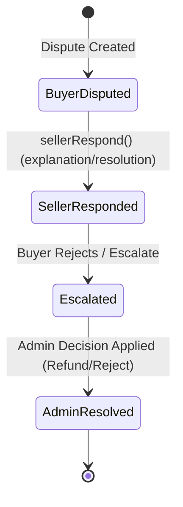

# Moderation & Disputes

This document outlines the content moderation workflow, order disputes, review reports, and administrator resolution pipelines.

---

## 1. Domain Models

*   **Dispute Model**: [Dispute.php](file:///c:/laragon/www/LikhangKamay/app/Models/Dispute.php)
    *   Tracks formal complaints raised by buyers regarding order delivery, item quality, or incorrect charges.
    *   Fields: `order_id`, `status`, `reason`, `proof_photos` (JSON array of image paths), `seller_response_type`, `seller_explanation`, `seller_proposed_description`, `escalation_reason`, `admin_notes`, `admin_decision`, `resolved_at`.
*   **Review Dispute**: [ReviewDispute.php](file:///c:/laragon/www/LikhangKamay/app/Models/ReviewDispute.php)
    *   Tracks complaints filed by sellers to report abusive, fraudulent, or off-topic product reviews.
    *   Fields: `review_id`, `seller_id`, `seller_owner_id`, `reported_by_user_id`, `status` (Pending, Resolved, Rejected), `reason`, `explanation`, `resolved_at`, `resolution_notes`.
*   **Flagged Content**: [FlaggedContent.php](file:///c:/laragon/www/LikhangKamay/app/Models/FlaggedContent.php)
    *   Polymorphic reports tracking flagged products, descriptions, reviews, or user accounts.
    *   Fields: `reporter_id`, `reportable_type` (polymorphic class reference), `reportable_id`, `reason`, `status` (Pending, Resolved), `resolved_by`, `resolved_at`.

---

## 2. Order Disputes Flow

Order disputes arise when a buyer is unsatisfied with a delivery or product.

### Action Controls
1.  **Response State**:
    The seller can respond using `sellerRespond()` inside [DisputeController.php](file:///c:/laragon/www/LikhangKamay/app/Http/Controllers/Core/DisputeController.php), submitting a proposed resolution and explanation.
2.  **Refund Escalation**:
    If unresolved, disputes can be escalated. The super admin makes the final binding decision (`admin_decision` = Approved/Refunded or Rejected).

---

## 3. Review Moderation Queue

Managed in [ModerationController.php](file:///c:/laragon/www/LikhangKamay/app/Http/Controllers/Admin/ModerationController.php):

*   **Review Flagging**: Sellers or other users can flag bad/inappropriate reviews.
*   **Administrative Actions**:
    *   **Hide from Marketplace**: The super admin can approve the review dispute, marking the review as hidden from the marketplace.
*   **Hidden Reviews Restrictions**: Reviews marked as hidden are disabled and cannot be pinned to the top of the product page by the seller.

### Core Business Actions
*   [BuyerInitiateDispute.php](file:///c:/laragon/www/LikhangKamay/app/Actions/Disputes/BuyerInitiateDispute.php): Validates and creates a new dispute entry for a completed order.
*   [SellerRespondToDispute.php](file:///c:/laragon/www/LikhangKamay/app/Actions/Disputes/SellerRespondToDispute.php): Saves the seller's explanation, proposed remedy, or refund consent.
*   [AdminArbitrateDispute.php](file:///c:/laragon/www/LikhangKamay/app/Actions/Disputes/AdminArbitrateDispute.php): Runs final super admin resolution choices (refund release or rejection).
*   [BuyerReactToDispute.php](file:///c:/laragon/www/LikhangKamay/app/Actions/Disputes/BuyerReactToDispute.php): Tracks the customer's response to the seller's proposed resolution.
